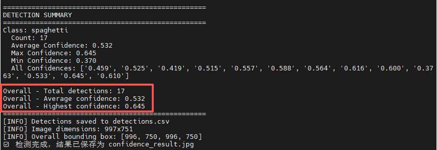

1. best.rknn 是训练好的炒面模型，把图片导入 Roboflow 标注后导出 YOLO 数据集。
2. 在Ubuntu上训练YOLO模型，导出模型并把它转换为  Rockchip 的 RKNN 格式 。

3. best.rknn 可以直接放在配置好 RKNN 环境的RK3566、RK3568、RK3588板卡上。
4. 可在test.py里配置图片和模型的路径，使用 python3 test.py，可以直接识别出图片中异常的置信度。

如下所示：

